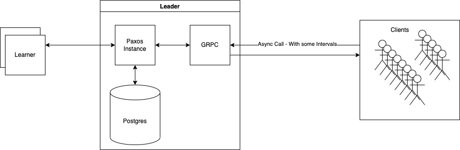

# PostgresPaxos
In this repository, we implement a **replicated Postgres** instance using **multi-Paxos** protocol.

## Architecture
This implementation uses gRPC for communication, and clients will run gRPC procedures in order to interact with the servers.




## Supported Input Procedures
```protobuf
rpc Put(Data) returns (Result) {}
```
Puts a `<key, value>` into the DB.
```protobuf
rpc Get(Key) returns (Result) {}
```
Gets the corresponding value for a specific key.
```protobuf
rpc Delete(Key) returns (Result) {}
```
Deletes a `<key,value>` from the DB.
```protobuf
rpc Clear(Partition) returns (Result) {}
```
Deletes all `<key,value>` from the DB.
```protobuf
rpc Batch(Values) returns (Result) {}
```
Put multiple `<key, value>`s to the DB in batch.

## How to run
### Ansible
We provide two ansible playbooks to install requirements and build/deploy applications on a distributed setup.
For more information, please refer to their [README](./ansible/README.md).

### Build
In order to run following program their code should be built by this command using maven: 
```
mvn clean install
```
### Server

**Step1.**  Configuration


Change the `./resources/config.properties` to the desired cluster. For example:
```java
discovery.nodes=localhost:8001,localhost:8002,localhost:8003
```
**Step2.** Run the servers
```
java -jar ./target/PaxosKV-server.jar <server_port> <postgres_port> <partition_number>
```
### Client
We implemented a simple client with `CLI` support. To run this client:

**Run the Client**
```
java -jar ./target/PaxosKV-client.jar <server_ip> <server_port> 
```

### Performance
This program benchmarks a cluster by putting a desired load on the system based on the provided configuration. 

#### How to use
```
java -jar ./target/PaxosKV-performance.jar --help                                                                                                                                                      10006
```
### Automated Benchmark
We provide some python scripts run `server` and `benchmark` programs automatically. For more information 
please refer to [benchmarks](./benchmarks)
